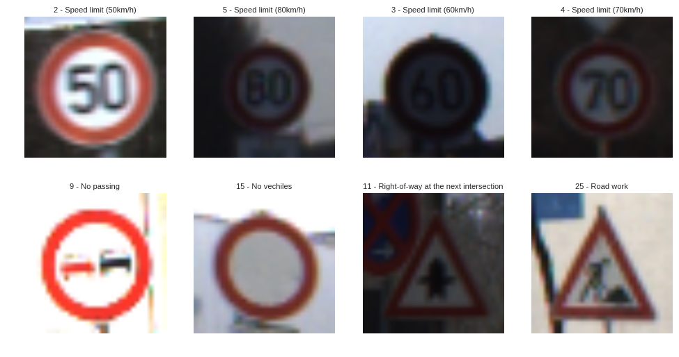
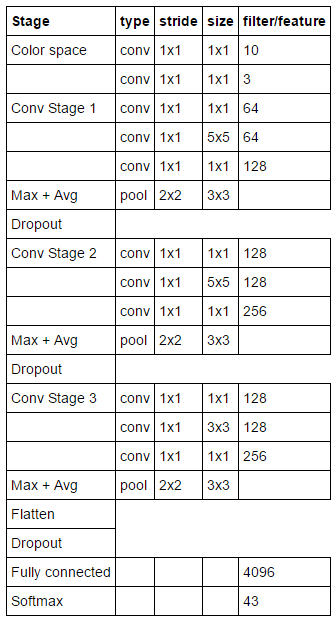

# Self-Driving Car Engineer Nanodegree

This project was created as an assessment for the [Self-Driving Car Nanodegree](https://www.udacity.com/course/self-driving-car-engineer-nanodegree--nd013) Program by Udacity. The goal is to classify traffic signs into one of 43 classes using deep learning. 

# Overview

The final network has a accuracy of 98.39% on the test set. The architecture can be seen below.

## Dependencies

This project requires **Python 3.5** and the following Python libraries installed:

- [Jupyter](http://jupyter.org/)
- [NumPy](http://www.numpy.org/)
- [SciPy](https://www.scipy.org/)
- [scikit-learn](http://scikit-learn.org/)
- [TensorFlow](http://tensorflow.org)

## Dataset

The dataset used is a preprocessed version of the [German Traffic Sign Dataset](http://benchmark.ini.rub.de/?section=gtsrb&subsection=dataset). The images were already resized to 32x32 pixels and stored in two pickel files. You can download the pickled dataset [here](https://d17h27t6h515a5.cloudfront.net/topher/2016/October/580d53ce_traffic-sign-data/traffic-sign-data.zip).

